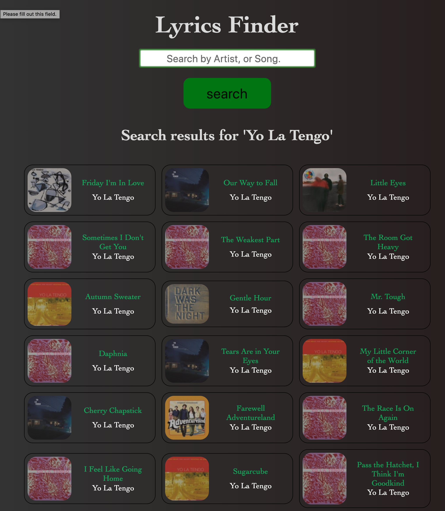
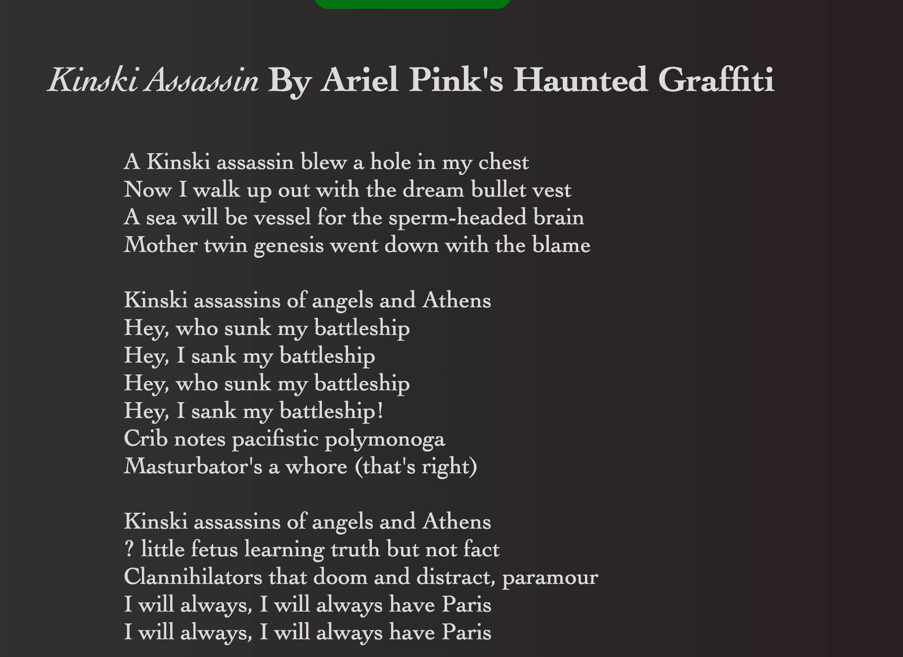

Name: Lyrics Finder

Live link: https://eyeaxamsterdam.github.io/Lyrics-Finder/

Summary: This is a simple app that allows the user to search for lyrics of songs. A search is performed using song title, artist, or otherwise music related query, and results will be displayed on the DOM. Itunes API will make a call to display 50  results. Displayed is the song, artist, and album cover. A selection is made from this search result and the lyrics are rendered in the DOM by Orion lyrics api.

Technology used: HTML/CSS/JavaScript/jQuery & AJAX